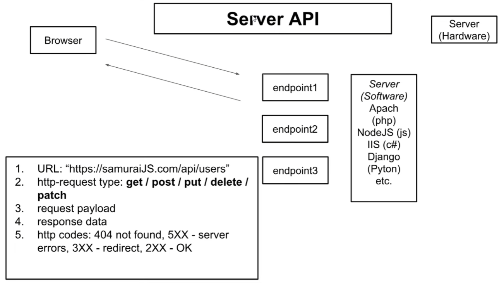

# React Samurai course <br> ( react + redux )
___
## Структура проекта

 Файлы из уроков лежат в папке `lessons`. 
 Некоторые уроки будут пропущены из-за их простоты. 
 Добавляться будут преимущественно темы с паттернами. 
 Файлы в корне - текущие на момент разработки соц. сети

## Откат к предыдущим коммитам

1. `gitk --all&` - запуск графического интерфейса для просмотра коммитов. 
2. `SHA1 ID` - id коммита, который нужно скопировать ( ctrl+insert ).
3. `git checkout <id>` - откат к коммиту, где id - sha1 id коммита

## CSS-modules

Назвать файл, например, не **index.css**, a **index.modules.css**.
Теперь при импорте в jsx, импортируется объект с уникальными классам. 
Пример использования:   
```jsx
import classes from './index.modules.css';
<nav className={classes.nav} />
<header className={classes.header} />
```

## UI - BLL

**BLL** (Business Logic Layer) - отвечает за данные, которые приходят с сервера ( Пример Redux ) <br>
**UI** (User Interface) - компоненты пользовательских интерфейсов ( Пример React )

## Множественная деструктуризация

```javascript
const obj = {
    name: "Arthur",
    parents: {
        mother: "Rihanna",
        father: "Dutch"
    }
}

const a = ({ parents: { mother, father }}) => {
    console.log(mother + " " + father);
}

a(obj); // => Rihanna Dutch
```

## React.createRef()

createRef() создает ссылку на jsx элемент, свойства которого
можно будет читать.

```jsx
const MyPosts = () => {
    
   const addPost = () => {
        // получаем input 
        alert(inputElement.current.value);
   }
   
   // Создаем ссылку на input
   const inputElement = React.createRef();

   return (
        <div>
         // указывем в ref ссылку
         <input ref={inputElement} type="text"/>
        </div>
   );
}

```

## Паттерн Observer

Этот паттерн позволяет избежать циклическую зависсимость
в проекте. Когда два или более файлов импортируют друг у друга
ф-ии или переменные.

```jsx
// index.js
import React from 'react';
import ReactDOM from 'react-dom';
import App from "./app";
import { state, addPost, updateNewPostText, subscribe } from "./state/state";

const rerender = () => {
 ReactDOM.render(
         <App state={state} addPost={addPost} updateNewPostText={updateNewPostText} />,
         document.getElementById('root')
 );
};

rerender();

subscribe(rerender);
```
```jsx
// state.js
let rerender = (state) => {};
export const subscribe = (observer) => {
 rerender = observer;
}
```

# Redux
___

## Container Component

Контейнерная компонента отвечает за диспатчи и возвращает 
презентационную компоненту, задача который лишь отобразить UI


```jsx
// myPostsContainer.js
const MyPostsContainer = ({ postsData, newPostText, dispatch }) => {

   const onChangeInput = ({ target: { value } }) => {
       dispatch(updateTextActionCreator(value));
   }
   
   const onButtonClick = () => {
       dispatch(addPostActionCreator());
   } 
 
   return <MyPosts
       postsData={postsData}
       newPostText={newPostText}
       onChangeInput={ onChangeInput }
       onButtonClick={ onButtonClick }
   />;
}
```

```jsx
// myPosts.js
const MyPosts = ({ postsData, newPostText, onButtonClick, onChangeInput }) => {
    console.log(newPostText);
    return (
        <div>
            <h1>My posts</h1>
            <input value={ newPostText } onChange={ onChangeInput } type="text"/>
            <button className={"my-posts-button"} onClick={ onButtonClick }>Add new post</button>
            <div>
                {
                    postsData.map( (data) => {
                        return <Post key={data.id} {...data} />
                    })
                }
            </div>
        </div>
    );
}
```

## Reducer'ы должны возвращать копии state'а 

```js
// dialogsReduces.js
const dialogReducer = (state = initialState, action) => {

    switch (action.type) {
        case UPDATE_NEW_MESSAGE:
            return {
                ...state,
                newMessageText: action.text
            };

        case SEND_MESSAGE:
            return {
                ...state,
                messagesData: [...state.messagesData, { id: uuid(), message: state.newMessageText }],
                newMessageText: ""
            }

        default:
            return state;
    }
}
```
```js
// contentReducer.js
const contentReducer = (state = initialState, action) => {

 switch (action.type) {

  case ADD_POST:
    return {
      ...state,
      postsData: [...state.postsData, { id: uuid(), message: state.newPostText, likesCount: 4 }],
      newPostText: '',
    }

    case UPDATE_NEW_POST_TEXT:
    return {
      ...state,
      newPostText: action.text
    }
    default:
      return state;
  }
}
```

## Server API
Application programming interface



## Лайфак для mapDispatchToProps

```js
const mapDispatchToProps = {
    onToggleFollow,
    setUsers,
    setCurrentPage,
    setTotalUsersCount,
    setFetching
};
```
Где `onToggleFollow`, `setUsers` ... - action creator'ы

## withCredentials

Вторым параметром в get запросе через axios идет конфиг, в котором
можно установить это свойство в true, тем самым позволяя слать
авторизованные запросы на сервак
```js
axios.get(`${API_BASE}/auth/me`, {
         withCredentials: true
    }).then(res => console.log(res));
```
## Библиотека Reselect

Пример: у нас есть ежесекундно диспачущий кусок кода в `index.js`.
```js
setInterval(() => {
    store.dispatch({ type: "FAKE"});
}, 1500);
```
Reducer:
```js
const initialState = {
    users: [],
    pageSize: 100,
    totalUsersCount: 0,
    currentPage: 1,
    isFetching: false,
    followingInProgress: [],
    followingId: null,
    status: "",
    fake: 10
};

const usersReducer = (state = initialState, action) => {
    switch (action.type) {

     //..................................//

        case "FAKE":
            return {
                ...state,
                fake: state.fake + 1
            }

        default: return state;
    }
}
```

**Reducer** каждую секунду обрабатывет dispatch и перерисовывает дерево
состояния всего приложения. Так же у нас есть подключенный к connect'у
компонент `users-page-container`. При каждом обновлении дерева состояния
срабатывает `mapStateToProps`, он проверяет изменилось ли хоть одно свойство,
в его списке. Если да, то отрендерит компонент заново.

```js
class UserPageContainer extends Component {
    componentDidMount() {
        this.props.getUsers(this.props.currentPage, this.props.pageSize);
    }

    componentDidUpdate(prevProps, prevState, snapshot) {
        if (prevProps.currentPage !== this.props.currentPage) {
            this.props.getUsers(this.props.currentPage, this.props.pageSize);
        }
    }

    render() {
        console.log("render");
        return <UsersPage {...this.props} />;
    }
}

const mapStateToProps = (state) => {
    console.log("MapState");
    return {
        users: getUsers(state),
        pageSize: getPageSize(state),
        totalUsersCount: getTotalUsersCount(state),
        currentPage: getCurrentPage(state),
        followingInProgress: getFollowingInProgress(state),
        isFetching: getIsFetching(state)
    };
};

const mapDispatchToProps = {
    onToggleFollow,
    setCurrentPage,
    setFollowing,
    getUsers: getUsersThunk,
    toggleFollow: toggleFollowUserThunk
};

export default connect(mapStateToProps, mapDispatchToProps)(UserPageContainer);
```

Обратим внимание на `getUsers`:
```js
const getUsers = state => state.usersPage.users.filter(u => true);
```
Это ф-ия селектор которая фильтрует массив пользователей. Метод filter возвращает новый
массив, следовательно `mapStateToProps` будет считать, что свойство users изменилось, и
следовательно перерисовывать компонент всякий раз когда происходит dispatch из `index.js`.

Для решения проблемы будем импользовать библиотеку reselect. Она будет возвращать новое
значение из селектора только тогда , когда что-то поменяется в списках пользователей:
```js
const getUsers = state => state.usersPage.users;

export const getUsersReselect = createSelector(getUsers, (users) => {
    return users.filter(u => true);
});
```

Селектор может зависеть и от нескольких свойств:
```js
const getUsers = state => state.usersPage.users;
const isFetchin = state => state.usersPage.isFetchin;

export const getUsersReselect = createSelector(getUsers, isFetching,
         (users, isFetching) => {
             return users.filter(u => true); 
         });
```


